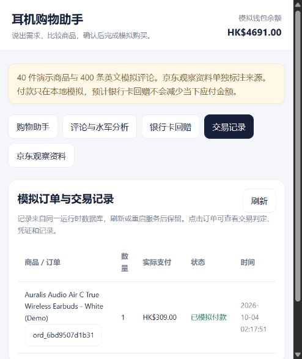

# 验收 · 2026-10-04

## 完成状态

已完成本地模拟项目整合：A 的多轮对话/授权，B 的正式搜索/排序/对比，D 的 40 件商品/400 评论/8 观察，C 的最终权限判定/原子交易/凭证/审计，通过同一运行库连接。

运行健康检查：catalog schema v2；40 products、400 reviews、8 observations；HKD；17 个 OpenAPI 路径；默认 local_rules 解析模式；审计链和对账正常。

## 自动验证

完整运行 `python -m pytest -q`：**817 passed，39 subtests passed，0 failed**。耗时约 15 秒。固定依赖的 Starlette/httpx 提示弃用 warning 一条，保持团队 lock，不另装冲突依赖。

包括队友已有授权、撤销、额度/频次/数量、幂等重放、并发、回滚、付款失败/未知结果、审计等测试；并补充：

- 正式颜色搜索 → 同 SKU 报价 → Visa 授权 → 付款 → 同库库存/余额/记录；第二次点击不再次扣钱，重启保留交易。
- 显式 db_path 同时控制搜索、详情、报价与库存，零库存报价被拒绝。
- 全部 tags 必须匹配，未知设备或配送不通过，明确设备筛选不误解成签署授权。
- 所有 40 件平均星级都使用该件全部评论评分，检测结果不改变原始平均值，API 不泄露答案标签。
- 取消当前选择不扣余额或消耗库存。
- 银行用户示例 1000/2500/5000 港币、余数滚存、推广条件、月度封顶、渠道排除、未知条件和只读余额。

## 浏览器验证

实际页面 `http://127.0.0.1:8768/`：白色无线、300 内、必须降噪返回 hp_0008。报价商品 HK$299 + 运费 HK$10 = 应付 HK$309，确认授权后模拟付款成功，钱包 HK$5,000 → HK$4,691，库存 5 → 4，订单和凭证可读。

浏览器测试订单 `ord_6bd9507d1b31` 保存在**本地预览运行库**，不打入源码 ZIP。交付包解压后首次初始化余额 HK$5,000，hp_0008 库存为原种子 5。

评论页选择 hp_0003，显示原始平均 4.7/5、10 条评论、6 条有可疑迹象，可筛选并展开英文原文依据。

银行卡页的演示学生/已登记/直接过卡/15 日内志账/未封顶条件下，HK$1,000 显示 HSBC HK$4、MMPOWER HK$50，同时说明应付仍 HK$1,000。资格是可编辑的假设，没有银行核验。

API 示例是上述本地验收后的响应快照，库存值随本地测试变化；seed 与 fresh runtime 初始化值以种子为准。

## 交付包检查

源码 ZIP 已校验 CRC 并重新解压到独立目录。使用同一套团队固定依赖在解压目录执行 init_demo：首次正确导入 40 件商品、400 条评论、8 份观察，schema v2。解压目录的六项跨模块测试全部通过；启动器参数入口也正常。冷启动验证复用已有固定依赖环境，没有重新联网安装依赖。

ZIP 不含 var、运行 SQLite、缓存、虚拟环境或实际 .env。打包文本中未发现常见 OpenAI/GitHub key 格式。团队 requirements.lock.txt 与原产品种子保持源文件内容。

## 评论离线评估

检测器只读公开文本与评分，先产生预测，再由独立脚本加载答案核对。400 条中 70 条模拟协调评论，TP=60、FP=0、FN=10，precision=1.0、recall=0.8571、F1=0.9231。10/10 件受影响商品找到，正常商品误报 0。

这是单一模拟开发集上的离线结果，没有独立保留集或真实世界验证。标记表示文本迹象，不是付费水军的证明。见 review-evaluation.json。

## 未接入的外部能力

真实京东登录/下单/扣款、真实银行资格核验、真实退款及生产多用户账户认证没有实现，不属于用户确认的本轮模拟结算范围。可选 LLM 已接入需求理解与商品/评论解释。2026-10-04 使用用户提供的 DeepSeek 配置完成两轮实际调用；中文版预算“三百港币”正确转为 30000，白色/无线/降噪条件保留，评论追问不重新排序候选。API 返回 deepseek-flash。联网不稳定或解释格式不合格时会回退，页面明确标记。交付 ZIP 默认离线，不含实际 key；用户本机已启用的配置单独保留。交易内核不读取评论答案，也不把预计回赠当可用资金。

## 模型解释更新验收

更新后 826 项测试、39 个子测试通过。模型只生成浏览解释，价格与数值规格由目录字段渲染；拒绝不存在的产品、无依据的评论 ID、未知规格引用、虚构金额及付款声明。解释失败时保留原候选与条件，明确回退。购买按钮不调用模型，C 的授权与付款流程继续由确定性代码执行。修复前端签署授权后再次报价丢失执行按钮的问题，前端保留本会话生效授权的显示状态，后端仍最终核验权限。

两轮实际 API 对话最后一次验证分别用时约 5.5 秒和 4.9 秒，均成功解析并生成评论解释；此前观察到供应商连接中断/超时，回退已生效。因此不保证每轮联网可用。运行时成功调用计数仅代表收到 API 响应，解释是否通过校验看该轮 trace。

补充实测：黑色/无线/必须降噪/预算五百港币/续航优先，模型正确解析为 50000 并比较显示的三款，指出最长续航款的佩戴重量未知、较便宜款的续航取舍及负面评论，解释通过校验。候选顺序仍来自 B，模型未改动排序。

## 价格排序与翻页修复

直接复现“1000元以内最好的耳机，价格越高越好”：前三价格为 599、589、549 港币。明确价格方向以原话作为依据传给 B，在全量硬条件合格目录上排序后截取。换一批保留条件及方向，排除此前已展示商品；超过 20 件仍可持续翻页，全部看完明确提示并保留当前排名引用。“查看全部商品”展示首 20 件并继续支持换批。翻页直接查 B/D，不额外调用模型。共享 DTO、HTTP envelope、交易数据未改变。新增五项回归覆盖方向切换、无预算排序、筛选保持、36 件不重复遍历及不调用模型/不移动资金。

全项目验收：831 项测试、39 个子测试通过。补齐翻页文字逐件显示后，247 项对话与跨模块测试通过。实际网页也验证价格前三为 599/589/549，下一批六件为 529/519/499/489/479/459，原订单及余额保留。
